# Lecture Monitor by Group Aratech

**This document is to provide a brief overview of the project and it's usage**

## OVERVIEW

Lecture monitor is a project which helps in monitoring the academic activities of students and lecturers.

Lecture Monitor allows students set easily set up accounts and setup personal time tables to easily track their activities and events. Students too are part of a class or department which has it's timetables as well

## TECHNOLOGIES USED

Lecture monitor is based on a wide range of technologies from front to back and even mobile.
These technologies include:

- JavaScript Programming Language
- MongoDB Database
- Express.js on the backend
- ReactJS on the frontend
- Native android development with the Java Programming Language

Other services that were used in the application includes

- [SendGrid](https://sendgrid.com) - For easy sending of transactional emails within the application.
- [MongoDB Atlas](https://cloud.mongodb.com) - A free cloud mongodb server, useful when deploying the application.
- [Cloudinary](https://cloudinary.com) - A free file hosting service for storing images, as well as all other types of file documents.
- [Heroku](https://heroku.com) - A free hosting platform where the production version of the application is hosted.
- [Netlify](https://netlify.com) - A free hosting platform for frontend javascript applications.

## SYSTEM OVERVIEW

The backend, frontend and mobile are completely decoupled from each other. The backend service, interacts with the mongoDB database.

Authentication is achieved using JSON web tokens, which is used to securely authenticate users on the platform. Using passportJS, the system is able to properly authorize users. This token is securely saved in localstorage on the browser and inside a shared preferences file on the mobile device.

### Backend

The backend uses NodeJS/ExpressJS as the main framework. it follows the Model Route Controller architectural pattern. It uses the popular mongoose library to connect to the database. The backend is reponsible for

1. Authenticating and authorizing users
1. Interacting with the database and serving data via the mongoose library and bringing back the data in the form of JSON
1. The backend is also responsible for sending the files over to cloudinary for them to be stored there.

### Frontend

The frontend uses ReactJS as the library of choice. It provides a web view that interacts with the backend through rest api, using the axios library. Complete list of libraries used within the frontend include

- axios - For connecting to the backend rest api
- redux - A production ready state management solution for javascript applications
- react-redux - A react wrapper for redux
- redux-thunk - A redux middleware that allows writing actions that return a function instead of an action
- UIKIT - a CSS framework that allows easy creation of beautiful web pages
- Cogo Toast - For displaying nice toast messages inside react
- Node-Sass - Easy compilation of sass code into css
- moment - An easy to use date and time utility library for javascript
- Formik and yup - For easy form validation
- React router dom - For routing inside react application, etc

### Mobile

The mobile application uses Java as the programming language of choice, which is used to build a native android application. Some libraries used by the mobile application includes

- Google material design library - For beautiful designs following the material design specification
- Glide - For easy loading of images
- Retrofit and okhttp - For connnecting to the backend rest api, etc

The web app can be accessed at https://lecture-monitor.netlify.app

### Screenshots

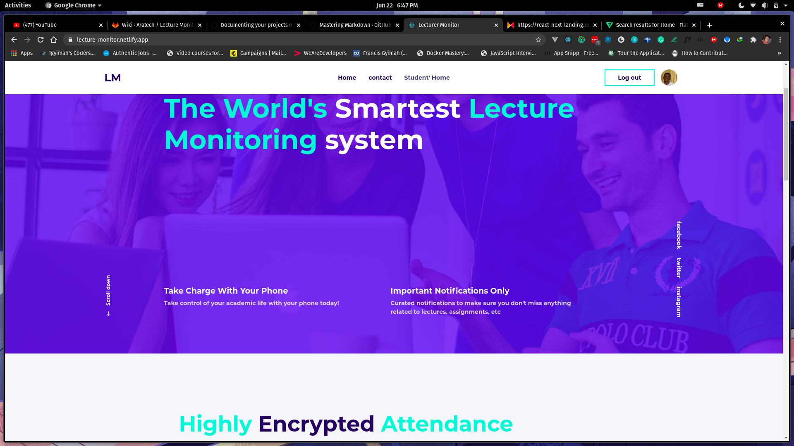
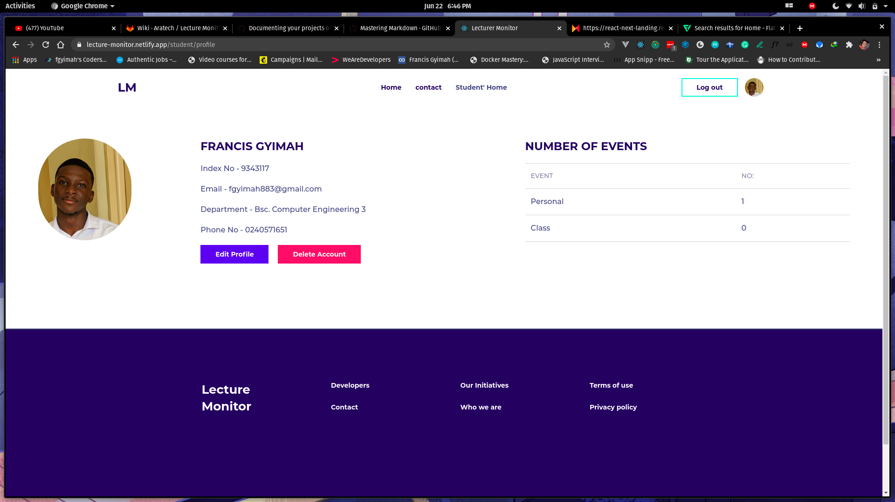
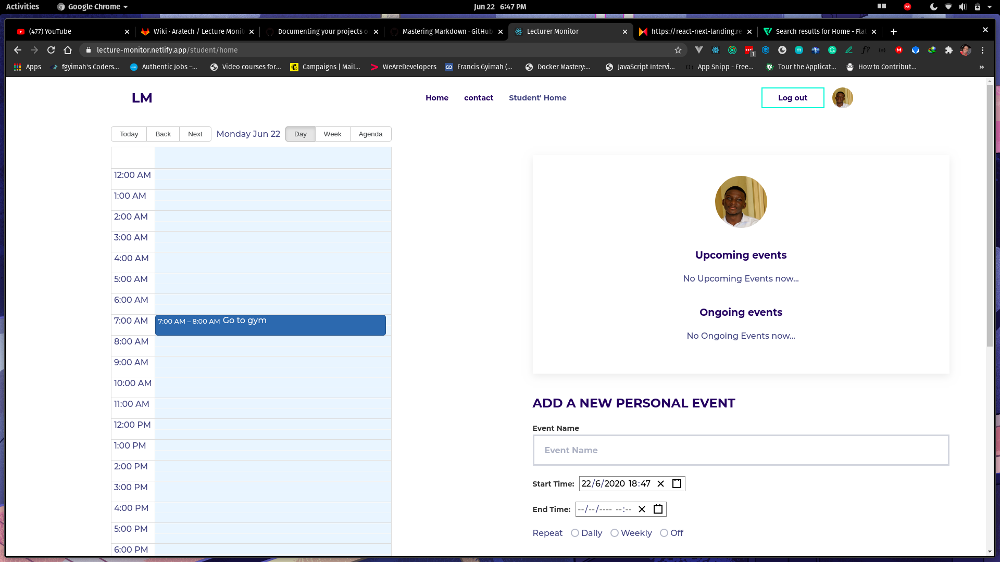
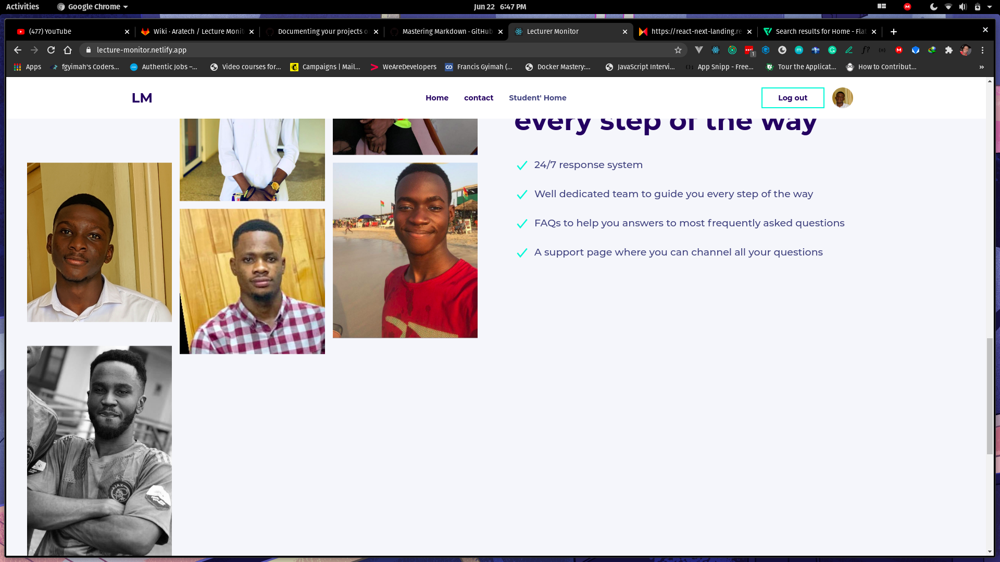
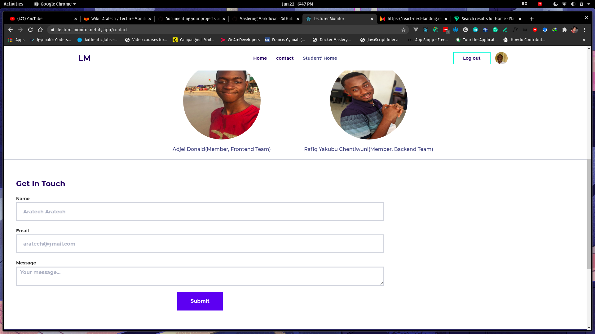
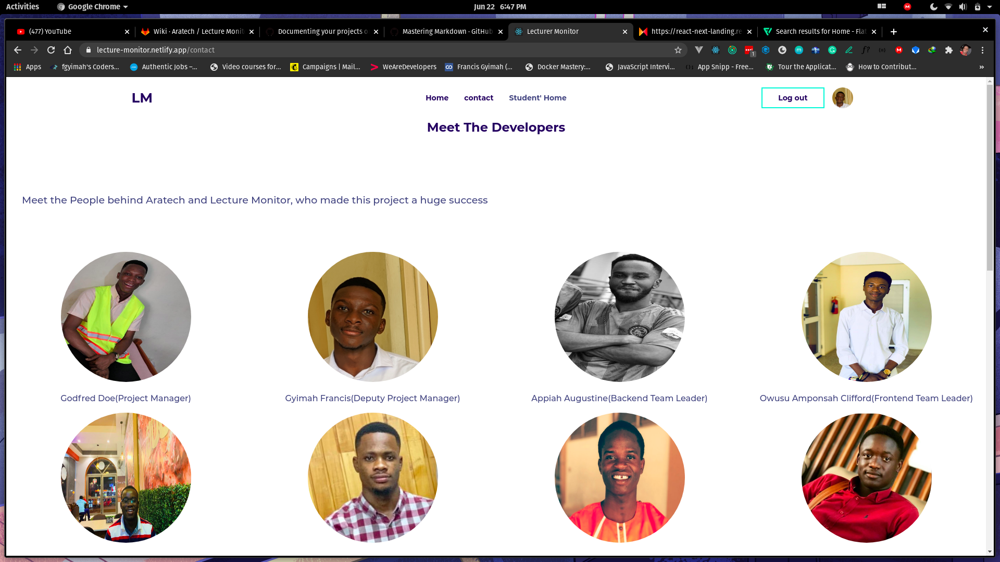
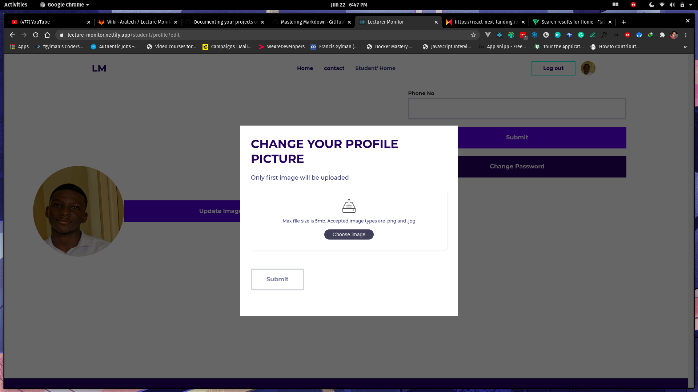
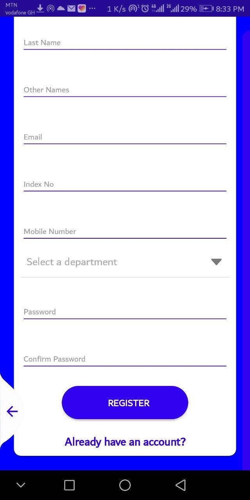
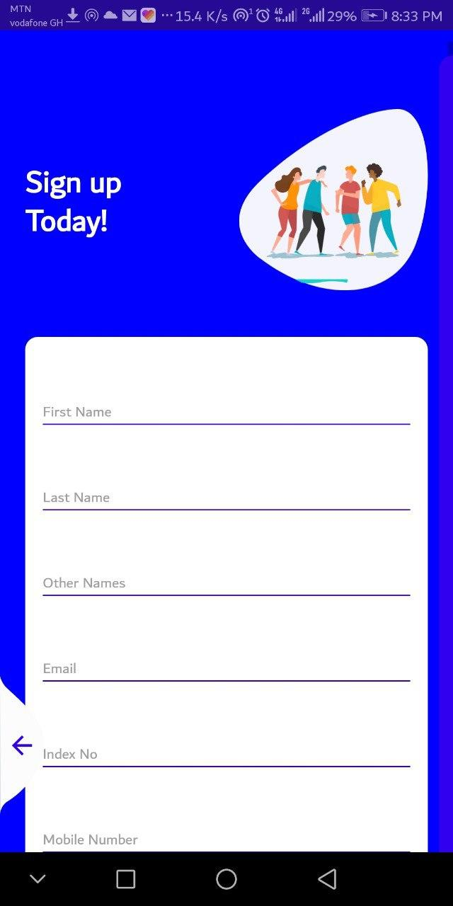
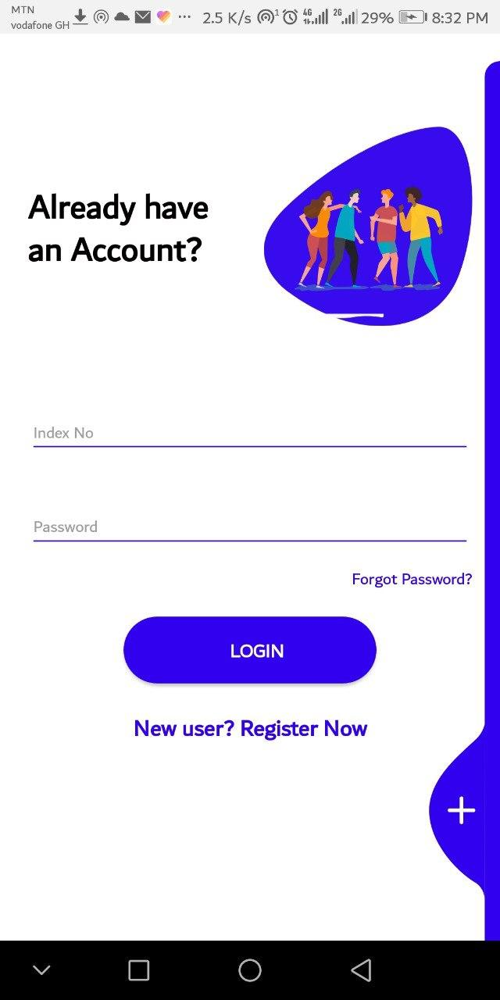
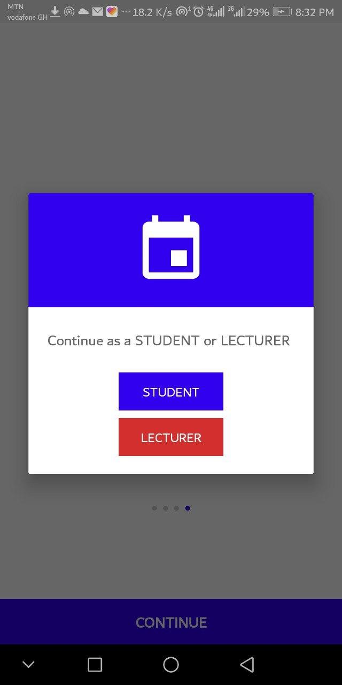
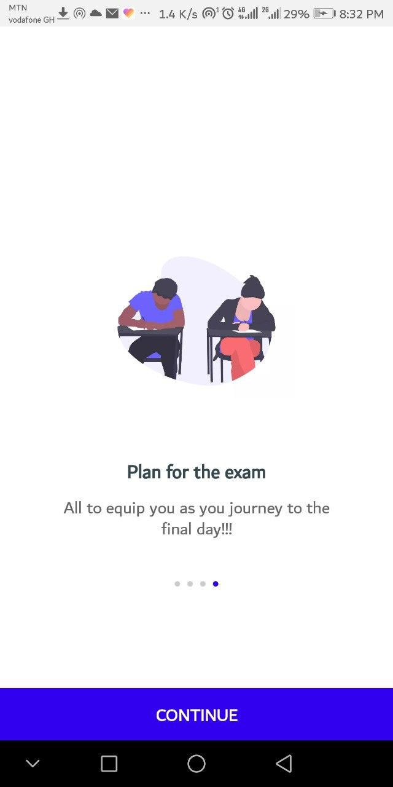
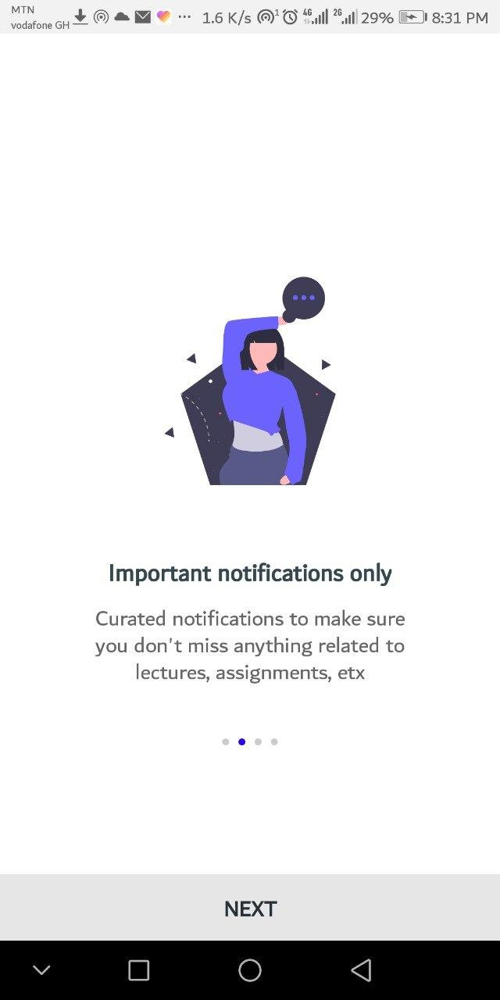
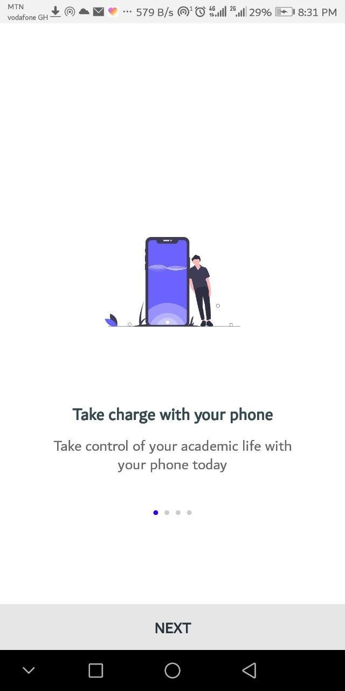
